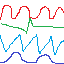
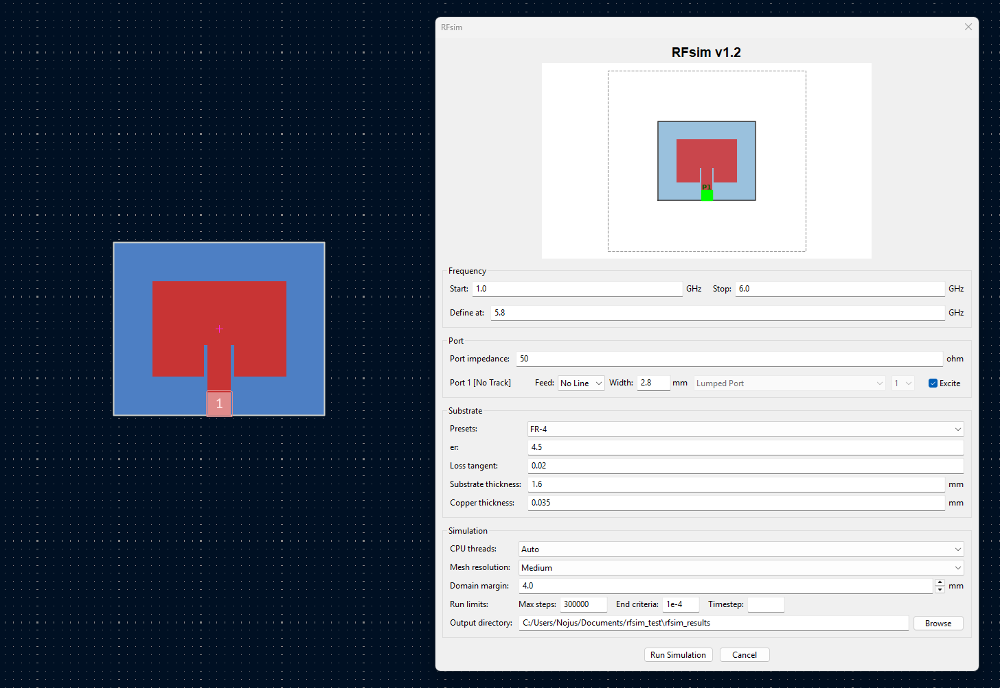
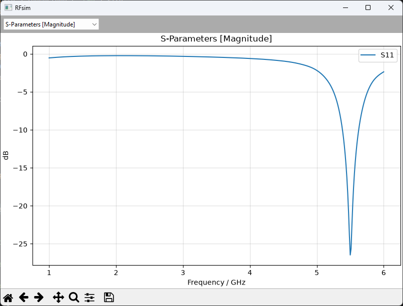
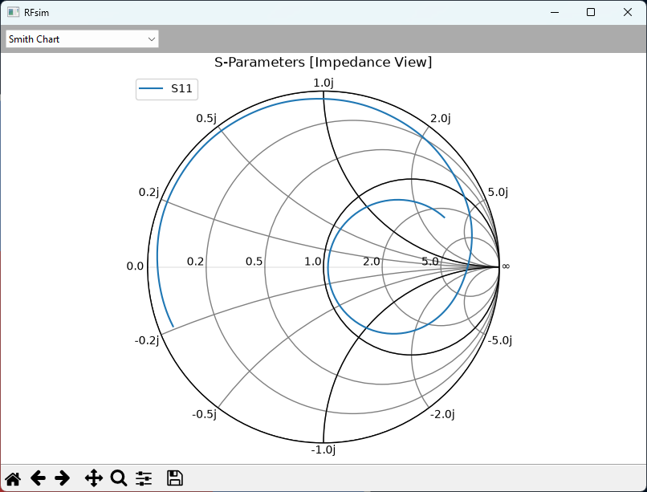
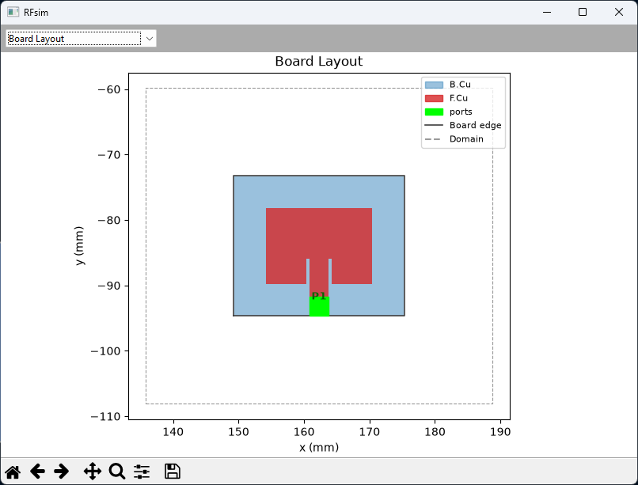
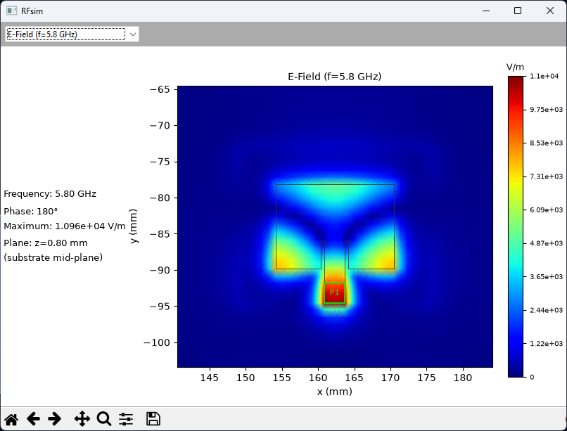
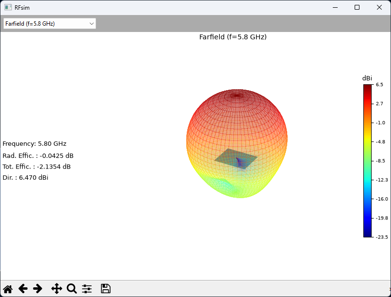

# RFsim

Simulate the S-parameters of an RF structure directly in the PCB editor
of KiCad 10.0, with the [openEMS](https://openems.de) FDTD solver. The
geometry goes from the native board objects of KiCad to the primitives of
CSXCAD.

## Features

- Simulate the S-parameters of any number of ports. The plugin plots the magnitude, the phase, a Smith chart, the VSWR and the group delay, and it writes a Touchstone (`.sNp`) file.
- Calculate the far field with NF2FF. The plugin plots three polar cuts in absolute dBi and a 3D radiation pattern that you can rotate. It also gives Dmax and the radiation efficiency.
- Animate the E-field and the H-field on the mid-plane of the substrate, with one view for each excited port.
- Draw the board layout that the solver uses: a preview in the dialog and a view with the results.
- Extract the geometry directly from the board: the pads, tracks, arcs, vias, filled zones and the graphic shapes on the copper layers.
- Model the resistors, inductors and capacitors as lumped elements, with the value from the footprint. The plugin also adds the ESL and the ESR of the package, which put the self-resonance of a real part at the correct frequency.
- Read the impedance of a line and its effective permittivity from a de-embedded port. The plugin plots Z0 against the frequency for the real track on the real stackup.
- Feed each port as a lumped port, or as a de-embedded microstrip (MSL), coplanar (CPW) or stripline port.
- Define the substrate: εr, tanδ, the height and the copper thickness.
- Mesh the structure at three resolutions: coarse, medium and fine.
- The solver runs in a different process. Thus, a crash cannot stop KiCad, and the same runner also works without a GUI.
- Run the engine on more than one CPU thread. "Auto" reads the size of the mesh and selects the count.

## Installation

1) Download the [latest release ZIP file](https://github.com/NBalciunas/kicad-rfsim/releases).
2) Open KiCad and in the main window click on "Plugin and Content Manager".
3) Click "Install from File..." and select the downloaded ZIP file.
4) Install `scikit-rf`, `matplotlib` and `h5py` into the Python of KiCad:

   ```bat
   "C:\Program Files\KiCad\10.0\bin\python.exe" -m pip install --user scikit-rf matplotlib h5py
   ```

   > If KiCad is installed for one user only, its Python is in `%LOCALAPPDATA%\Programs\KiCad\10.0\bin`.

5) Install openEMS. Download the newest `openEMS_x64_v*_msvc.zip` from the [openEMS releases](https://github.com/thliebig/openEMS-Project/releases). Extract the `openEMS` folder to `C:\openEMS`.

   > For a different folder, set the `OPENEMS_PATH` environment variable.

6) Install [Python 3.14](https://www.python.org/downloads/), then make the venv of the solver:

   ```bat
   py -3.14 -m venv C:\openEMS\venv
   C:\openEMS\venv\Scripts\python.exe -m pip install --find-links C:\openEMS\python csxcad openems
   C:\openEMS\venv\Scripts\python.exe -c "import os; os.add_dll_directory('C:/openEMS'); import CSXCAD, openEMS; print('ok')"
   ```

   > The last command must print `ok`. A warning about the version of HDF5 is not a problem.

7) Restart KiCad. The plugin is now installed.

## Usage



1. Click a pad in the PCB editor. It becomes port 1. Hold the shift key and click more pads for more ports.
2. Click the **RFsim** icon in the toolbar.
3. Look at the preview at the top of the dialog. It shows the ports, the R/L/C parts and the domain, and it follows the "Domain margin" field and the "Model" checkboxes.
4. Set the sweep range, "Define at" (the frequency of the field views and the far field), the port impedance, the number and the type of each port, the substrate, the CPU threads, the mesh preset, the domain margin and the output directory.
5. Click Run Simulation. The results open in a plot window, and `results.sNp`, `model.json`, `lines.json` and `farfield_pN.json` go into the output directory.

### Ports

The dialog shows each port as `Port N`, with the pad, the footprint and the net in the tooltip. The label of a port names what the geometry does not give, for example `Port N [No Track]` or `Port N [No Coplanar Gap]`. Each port shows a "Feed" control with the direction and the width of its line. A routed track fills the two values and locks them. If the feed line is drawn copper (a graphic shape or a polygon, usual for a patch antenna), select the direction and enter the width yourself: the de-embedded types then become available. The port lies on the copper along that direction, so make sure the line is really there - the plugin gives a warning when it finds none. The type list holds only the types that the geometry permits, and the CPW entry shows the measured gap. For a CPW port the copper at the two sides of the line must be ground: the plugin measures the gap, but it cannot know the net.

A port needs a ground return: copper on the reference layer (the adjacent copper layer) that reaches at least the edge of the pad. Without it the plugin refuses to run. A CPW is the one exception, because its return path is the copper at the sides of the line.

The dialog gives only the types that the geometry permits:

| Type | It needs | Notes |
|---|---|---|
| Lumped Port | nothing | It drives the pad against the reference layer. It operates everywhere. |
| Microstrip (MSL) Port | a track that leaves the pad on the x-axis or the y-axis, or a "Feed" direction and width | De-embedded. |
| Coplanar (CPW) Port | a track or a "Feed" direction, and copper at the two sides of it | The plugin measures the gap from the board. |
| Stripline Port | a track or a "Feed" direction, and a plane above the strip and a plane below it | Put the port on an inner layer. |

> **The CPW port gives an impedance that is about 20% too small.** It finds the correct mode, and its eps_eff agrees with the theory, but the value of Z0 does not, and a finer mesh does not correct it. Use the CPW port to look at the fields and at the mode, and treat its impedance as approximate. The microstrip port and the stripline port agree with closed-form theory. The plugin gives a warning when a column of the S-matrix gives out more power than it takes in, which shows S-parameters that you must not use.

Each excited port costs one full FDTD run. Port 1 supplies the field views and the far-field views.

### The impedance of a line

A de-embedded port measures the impedance of the line and its effective permittivity from its own probes. The results window shows the real part and the imaginary part of the impedance in the "Line Impedance" view, and the solver writes all the values, the effective permittivity included, to `lines.json`. These values are for the real track on the real stackup, and not for the reference impedance of the dialog. A lumped port has no line, thus it gives no such value.

The coarse preset gives a value that is too small: the microstrip of `validation/` gives 44 ohm at coarse, 47 ohm at medium, and the theory gives 50 ohm. Use medium or fine when the number is important.

### The substrate and the domain

The values in the dialog always have priority, and the plugin makes a uniform stackup from them. It reads the `(stackup ...)` section of the board file only for a run without a GUI. KiCad does not give that section to Python, thus you must save the board first.

The domain fits the full board and adds the margin as air around it. The plugin cuts the copper that crosses the outer edge. For an antenna, give the radiator more space before the absorber: a margin of 15 mm or more (about λ/8 at 2.4 GHz), not the default 4 mm.

### Accuracy

The coarse preset is for a first look. A small lumped element reads too large at that resolution, so use medium or fine when the value of the element matters. For the behavior of the solver itself, refer to the [openEMS documentation](https://docs.openems.de).

The plugin adds the parasitics of the package to each R/L/C part: an ESL from the package code of the footprint, and an ESR. The values are for the body of the part only, because the mesh already contains the loop of the pads and the tracks. A capacitor becomes ESR + ESL + C, which is the usual model of a real capacitor. An inductor gets its DCR, but the model does not give its self-resonance. Select "No parasitics" in the row of a part for an ideal element, or change `esl` and `esr` in `model.json`.

The "Lumped elements" part of the dialog gives one row for each R/L/C part. Each row shows what the part is and what value the plugin read from the board:

```
[ Resistor "R1"  ] [ 50 ohm ]     Parasitics: [ Custom       ]  ESR: [ 0    ] ohm  ESL: [ 0.4  ] nH  [x] Model
[ Capacitor "C2" ] [ 4.7 pF ]     Parasitics: [ 0402 Package ]  ESR: [ 0.03 ] ohm  ESL: [ 0.25 ] nH  [x] Model
[ Inductor "L3"  ] [ 10 nH  ]     Parasitics: [ No parasitics ]                                 [x] Model
```

"Model" is on for each part. Remove it from one part, and the model does not contain that part: its pads stay in the copper, thus the gap between them stays open. This is the same control as "Excite" at a port, but for one part.

The plugin reads the package from the name of the footprint: `R_0402_1005Metric` gives `0402`. It knows 0201, 0402, 0603, 0805, 1206, 1210, 2010 and 2512, and it selects that preset ("0603 Package"). A name that has no such code (a metric-only name, a SOT-23, or a library of your own) gives "Custom", and you put in the two values. Select a different preset to change the ESL, or type a value to move the row to "Custom". "No parasitics" makes that part an ideal element: the two fields go off, but they keep their text for when you select a package again. The solver names the package of each part in its log.

## Examples

The following example shows the magnitude of S11 against the frequency.



The following example shows the Smith chart of the same run.



The following example shows the board layout, a top view of the structure that the solver used.



The following example shows the E-field on the mid-plane of the substrate. The plugin draws one view for each excited port.



The following example shows the 3D radiation pattern that you can rotate.



## Validation

The `validation/` folder makes its own test boards, runs the solver and compares the result against closed-form theory. Run the files with the Python of KiCad:

```bat
set KIPY="C:\Program Files\KiCad\10.0\bin\python.exe"
%KIPY% validation\run_rlc.py coarse
```

* **`run_rlc.py [mesh] [R1|L1|C1]`**  
Used to validate R, L and C against the theory for a series impedance between two Z0 lines. |S21| stays flat for R, it decreases for L, and it increases for C. The opposite slopes cannot come from an element that the solver ignored.
* **`run_lumped.py [mesh]`**  
Used to validate the lumped elements: a series resistor of 50 Ω in a 50 Ω line must give S11 ≈ −9.5 dB and S21 ≈ −3.5 dB, the ideal resistive divider. A gap that stays open gives about 0 dB.
* **`run_cpw.py [mesh] [cpw|stripline]`**  
Used to validate the CPW port and the stripline port against closed-form theory. The eps_eff of a stripline must be exactly εr, thus this is the most exact test in the directory. The stripline holds its impedance against the theory too. The CPW holds its impedance only against the value that the pipeline gives today: refer to the note about the CPW port above.
* **`test_ports.py`**  
Used to validate the geometry of the ports and the mesh: the box of each of the four types, the fallback to a lumped port, and the mesh line at the center of each via. It needs no KiCad and no solver, thus it takes some seconds. Run it with the python of the solver.
* **`run_headless.py [mesh] [msl|lumped]`**  
Used to validate the full path from the board to the Touchstone file. A microstrip line of 30 mm and about 50 Ω must give S11 < −10 dB and S21 > −0.5 dB from 1 GHz to 6 GHz.
* **`diag_lumped.py board.kicad_pcb`**  
Used to find why the plugin does not simulate an R/L/C part. It shows the result of each test, for each part.
* **`test_touchstone.py`**  
Used to validate the Touchstone writer. skrf must read back the same S-matrix, for 1 to 5 ports.
* **`make_test_board.py`**  
Used to make the microstrip board that `run_headless.py` needs, and the CPW board and the stripline board that `run_cpw.py` needs.

`%KIPY% plugins\board_reader.py` is the self-test of the value parser (21 cases).

## License

This project is licensed under the MIT License.
Copyright © 2026 Nojus Balčiūnas