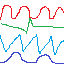
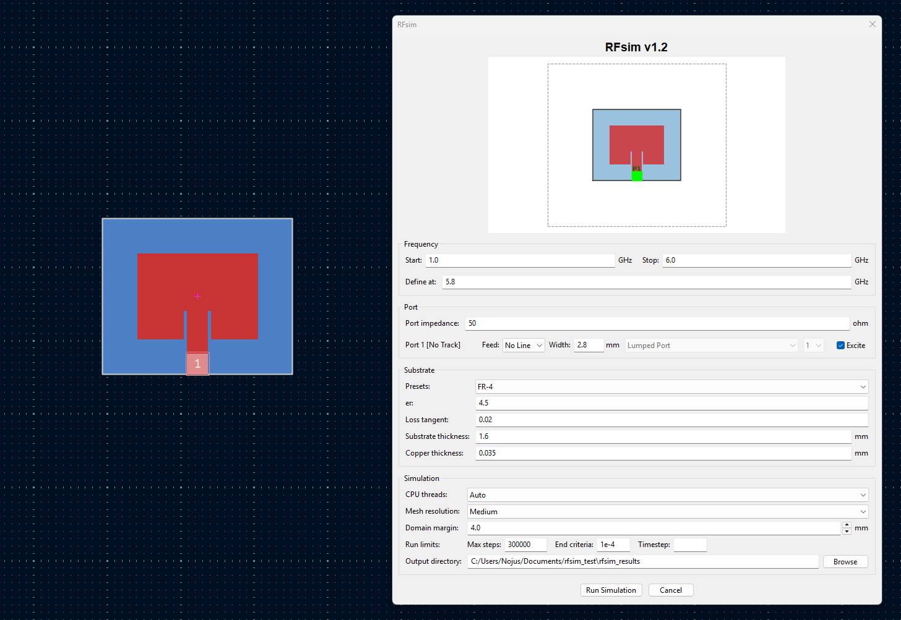
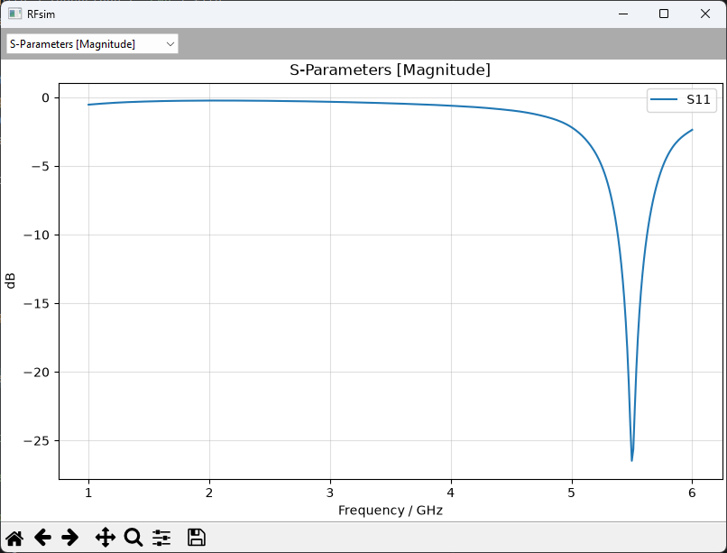
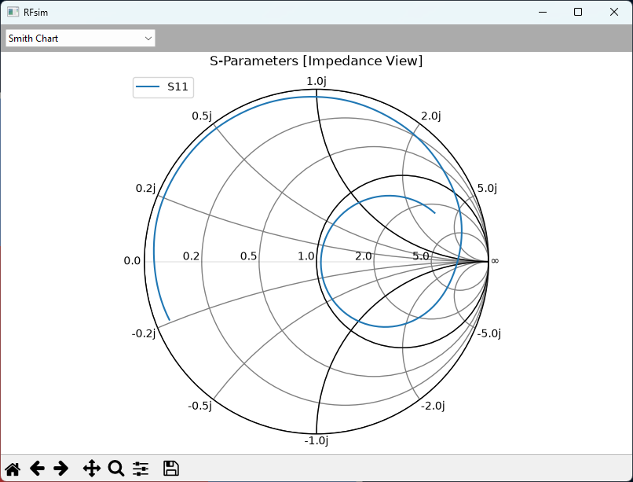
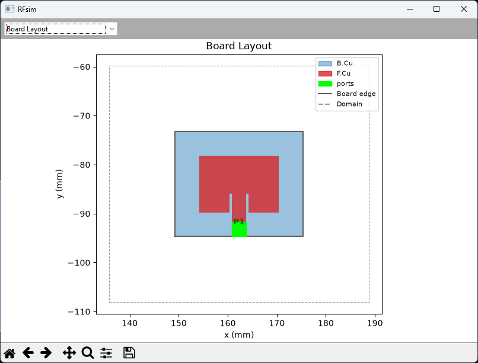
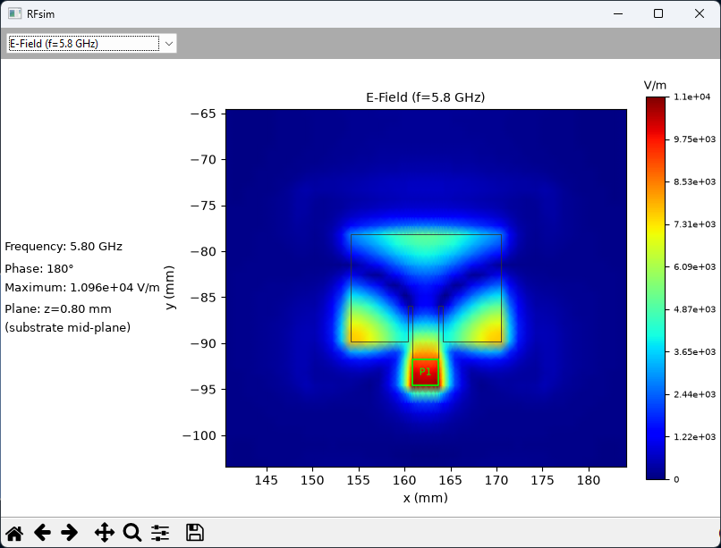
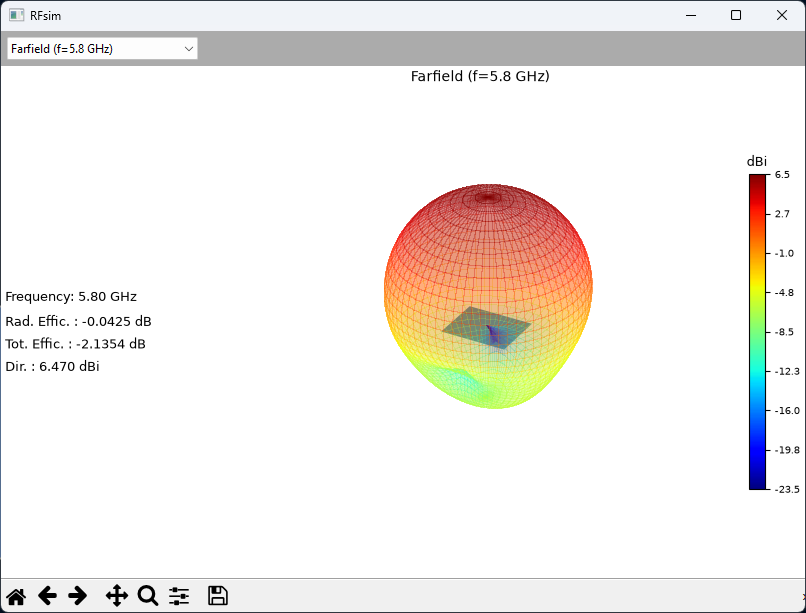

# RFsim

Simulate the S-parameters of an RF structure directly in the PCB editor of KiCad 10.0, with the [openEMS](https://openems.de) FDTD solver or the [EMerge](https://www.emerge-software.com) FEM solver.
The geometry goes from the native board objects of KiCad to the model of the solver.

## Features

- Simulate the S-parameters of any number of ports, and write a Touchstone (`.sNp`) file.
- Plot the magnitude, the phase, a Smith chart, the VSWR and the group delay. Clear the check box of a trace to hide it.
- Animate the E-field and the H-field on the mid-plane of the substrate, and the current on the copper of each port and its ground plane.
- Calculate the far field: three polar cuts, a 3D pattern, Dmax, the efficiency, and the co-polarization, the cross-polarization (Ludwig 3) and the XPD.
- Measure the impedance of a line and its effective permittivity from a de-embedded port.
- Model the R, L and C parts as lumped elements with the parasitics of the package, an inductor with its self-resonance, and any 2-terminal part as a series RLC.
- Simulate more than one set of part values (the states of a phase shifter), one run each, and compare the magnitude and the phase of S21 of the states.
- Feed each port as a lumped, microstrip (MSL), coplanar (CPW) or stripline port, or feed a through-hole pad from a coaxial connector on F.Cu or B.Cu.
- Extract the geometry from the board: the pads, tracks, arcs, vias, zones, shapes and text on copper.
- Draw the board layout that the solver uses.
- Set the substrate, the mesh preset and the CPU threads in the dialog.
- Select the solver in the dialog: openEMS (FDTD) or EMerge (FEM).

## Installation

1) Download the [latest release ZIP file](https://github.com/NBalciunas/kicad-rfsim/releases).
2) Open KiCad and in the main window click on "Plugin and Content Manager".
3) Click "Install from File..." and select the downloaded ZIP file.
4) Install `scikit-rf`, `matplotlib` and `h5py` into the Python of KiCad:

   ```bat
   "C:\Program Files\KiCad\10.0\bin\python.exe" -m pip install --user scikit-rf matplotlib h5py
   ```

   > If KiCad is installed for one user only, its Python is in `%LOCALAPPDATA%\Programs\KiCad\10.0\bin`.

5) Install at least one solver (step 6, step 7 or both). The dialog grays out a solver that is not installed.

6) Install openEMS (tested with v0.37.0-rc1). Download the newest `openEMS_x64_v*_msvc.zip` from the [openEMS releases](https://github.com/thliebig/openEMS-Project/releases) and extract the `openEMS` folder to `C:\openEMS`. Install [Python 3.14](https://www.python.org/downloads/), then make the venv of openEMS:

   ```bat
   py -3.14 -m venv C:\openEMS\venv
   C:\openEMS\venv\Scripts\python.exe -m pip install --find-links C:\openEMS\python csxcad openems
   C:\openEMS\venv\Scripts\python.exe -c "import os; os.add_dll_directory('C:/openEMS'); import CSXCAD, openEMS; print('ok')"
   ```

   > The last command must print `ok`. A warning about the version of HDF5 is not a problem. For a different folder, set `OPENEMS_PATH`.

7) Install EMerge (tested with 2.8.9). Make its venv with the Python of KiCad:

   ```bat
   "C:\Program Files\KiCad\10.0\bin\python.exe" -m venv C:\emerge\venv
   C:\emerge\venv\Scripts\python.exe -m pip install emerge==2.8.9 h5py
   ```

   > The first EMerge run compiles its code for some minutes. For a different folder, set `EMERGE_PATH`.

8) Restart KiCad. The plugin is now installed.

## Usage



1. Click a pad in the PCB editor. It becomes port 1. Hold the shift key and click more pads for more ports.
2. Click the **RFsim** icon in the toolbar.
3. Look at the preview at the top of the dialog: the ports, the R/L/C parts and the domain.
4. Select the solver.
5. Set the sweep range, "Define at" (the frequency of the field views and the far field), the ports, the substrate, the mesh preset, the domain margin (or only the area around the ports, for a large board), the run limits and the output directory.
6. Click Run Simulation. The results open in a plot window, and `results.sNp`, `model.json`, `lines.json` and `farfield_pN.json` go into the output directory.

### Ports

**A port is at a pad that you select, and it drives that pad against the adjacent copper layer.** Its box covers the whole pad and the whole substrate.

Each port needs copper at the pad on the reference layer, the adjacent layer below or, for an inner layer, above. Without it, the plugin does not run. A CPW port is the exception: its return path is the copper at the sides of the line.

The dialog gives only the types that the geometry permits:

| Type                  | Requires                                                 |
|-----------------------|----------------------------------------------------------|
| Lumped Port           | No requirements                                          |
| Microstrip (MSL) Port | Feed line on the x or y axis                             |
| Coplanar (CPW) Port   | Feed line on the x or y axis; Copper on both sides of it |
| Stripline Port        | Feed line on the x or y axis; Plane above and below it   |
| Coaxial Feed Port     | Through-hole pad; Copper around it on F.Cu or B.Cu       |

**A through-hole pad gets a coaxial feed and no lumped port.**
The port goes across the gap between the pad and the surrounding copper, on the side of the connector, and the barrel of the hole takes the signal through the board.
The type list gives one entry for each side with a gap of 3 mm or less, and the side of the footprint comes first.
A pad with no such gap and no track stops the run.

> Each excited port costs one full FDTD run. When a port gives out more power than it takes in, the plugin gives a warning: run again at the medium or the fine preset.

### The impedance of a line

The microstrip, the coplanar and the stripline ports measure their own line. The "Line Impedance" view shows Z0 against the frequency, and `lines.json` holds it with the effective permittivity. A lumped port has no line.

The coarse preset reads a little low: the microstrip of `validation/` gives 47.7 ohm at coarse, 47.8 ohm at medium and 48.6 ohm at fine, against 49.8 ohm from the theory.

### The substrate and the domain

"KiCad's Stackup" takes εr, tanδ and the thickness of each layer from Board Setup > Physical Stackup.
The dialog starts there when the board has a stackup, and the four fields are then read-only. A field with more than one value joins them with " / ".

> When the stackup has changes that you did not save, RFsim asks which values to use.

The other presets make a uniform stackup. They fill εr and tanδ, and "Custom" leaves the two fields to you:

| Preset                      | εr   | tanδ   |
|-----------------------------|------|--------|
| FR-4                        | 4.5  | 0.02   |
| Rogers RO4350B (stripline)  | 3.48 | 0.0037 |
| Rogers RO4350B (microstrip) | 3.66 | 0.0037 |
| Rogers RO4003C (stripline)  | 3.38 | 0.0027 |
| Rogers RO4003C (microstrip) | 3.55 | 0.0027 |
| PTFE                        | 2.20 | 0.0009 |

Rogers gives two εr for each grade: a stripline value and a larger design value for a microstrip.

**The loss of the substrate is correct at one frequency only**, the center of the sweep.
Over a sweep of 1 to 6 GHz, the model gave 3.1 times the real loss at 1 GHz and 0.66 times at 5.5 GHz.
When the loss is important, put the center of the sweep at the frequency that matters, or keep the sweep narrow.

The domain is the board, the margin of air around it, and an absorber 8 cells deep. Copper that crosses the outer edge ends in the absorber and does not reflect.

### Accuracy

The mesh preset sets the cells for each wavelength, at the shortest wavelength of the sweep in the substrate:

| Preset    | Cells per wavelength | Cell on FR-4, sweep to 6 GHz |
|-----------|----------------------|------------------------------|
| Coarse    | 10                   | 2.36 mm                      |
| Medium    | 20                   | 1.18 mm                      |
| Fine      | 40                   | 0.59 mm                      |
| Ultrafine | 80                   | 0.29 mm                      |

The preset sets only this step. The cells across the strip of a port, in the gap of a CPW and through the substrate are the same at each preset.

The coarse preset is for a first look, and a small lumped element reads too large there. Use medium or fine when a number is important. For the solver itself, refer to the [openEMS documentation](https://docs.openems.de).

### Lumped elements

Each footprint with 2 numbered SMD pads on one copper layer gives a row in the "Lumped Elements" part of the dialog.
**The first letter of the reference gives the type**: R, L or C. Each other 2-terminal part, for example a diode, starts at "Unknown" with "Model" off. It changes nothing until you select a type and give a value.

**The Value field of the footprint gives the value.** The same letters serve the three types, and the type gives the unit. The case is important: `4m7` is 4.7 mohm and `4M7` is 4.7 Mohm.

| Letter      | Prefix | Text              | Resistor | Capacitor | Inductor |
|-------------|--------|-------------------|----------|-----------|----------|
| `p`         | pico   | `4p7`             | 4.7 pohm | 4.7 pF    | 4.7 pH   |
| `n`         | nano   | `4n7`             | 4.7 nohm | 4.7 nF    | 4.7 nH   |
| `u` or `µ`  | micro  | `4u7`             | 4.7 µohm | 4.7 µF    | 4.7 µH   |
| `m`         | milli  | `4m7`             | 4.7 mohm | 4.7 mF    | 4.7 mH   |
| `R` `F` `H` | unit   | `4R7` `4F7` `4H7` | 4.7 ohm  | 4.7 F     | 4.7 H    |
| `k` or `K`  | kilo   | `4k7`             | 4.7 kohm | 4.7 kF    | 4.7 kH   |
| `M`         | mega   | `4M7`             | 4.7 Mohm | 4.7 MF    | 4.7 MH   |
| `G`         | giga   | `4G7`             | 4.7 Gohm | 4.7 GF    | 4.7 GH   |
| `T`         | tera   | `4T7`             | 4.7 Tohm | 4.7 TF    | 4.7 TH   |

**Each type has its own mark for the unit**, in upper or lower case: `4F7` on a resistor and `4R7` on an inductor give no value. Give such a value in the dialog.

The letter can also come after the number (`4.7k`, `22p`). The unit letter is optional (`10uH` reads as `10u`), and the unit can be a word (`10 kOhm`, `4.7 uF`). A word after a space, such as `10%` or `25V`, has no effect, and "DNP" gives no value. The dialog shows the value that the plugin read.

**Each row also holds the parasitics of the body** that its type uses: a resistor has an ESL, a capacitor has an ESR and an ESL, and an inductor has an ESR (its DCR).
The plugin reads the package from the name of the footprint (`R_0402_1005Metric` gives `0402`), from 8 codes between 0201 and 2512.
Any other name gives "Custom", and "No parasitics" makes an ideal element.
The run leaves out a body that changes |Z| of its part by 2% or less over the sweep, for example the ESL of a 1 kohm pull-up. The Optimizations view of the results names these parts.

**An inductor row also holds its SRF**, the self-resonant frequency in GHz from its datasheet. The plugin then adds the capacitance of the winding in parallel, and the run shows the resonance. 0 gives no self-resonance.
The resonance reads about 1% high on a wide land and about 9% high on an 0402 land. A land of one mesh cell cannot hold the capacitance, and the run says so.

**An inductance makes the run longer.** 0.25 nH or less costs nothing, 1 nH makes the run about 2 times longer, and 10 nH about 6 times. The ESL of a body counts as well.
The label under the rows of the parts gives the number before you start the run.
A part with an impedance of 200 times the port impedance or more over all the sweep is an open circuit. The run leaves it out at no cost, and the label names it.

**"Series RLC" is the type for a part that no single R, L or C describes**, for example a PIN diode that is off.
Its row holds R in ohm, L in nH and C in pF, in series, with no parasitics. 0 leaves that component out.

**"Edit States..." gives the parts more than one set of values**, for example the states of a phase shifter: a varactor at each bias, or PIN diodes that are on or off.
The grid has a column for each state and a row for each part with "Model" on. State 1 is the values of the rows, and the reference.
A cell holds the value in the unit of its row, or `R / L / C` for a Series RLC (`2 / 0.5 / 0` is a PIN diode that is on, `0 / 0.5 / 0.15` one that is off).
An empty cell keeps the value of State 1.

Each state is one run, in the folder `state_N` of the output directory.
The results window then has a "State" choice for the other views, and four views that compare the states: the magnitude, the phase and the phase difference (to State 1) of S21, and the magnitude of S11.
A block of text gives the value of each state at "Define at".

## Examples

The magnitude of S11 against the frequency:



The Smith chart of the same run:



The board layout that the solver used:



The E-field on the mid-plane of the substrate, with one view for each excited port:



The 3D radiation pattern, which you can rotate:



## Validation

The `validation/` folder makes its own test boards, runs the solver and compares the result against closed-form theory. It has three folders:

* `validation\common\` - the tests that need no solver, the builders of the test boards, and the rigs that the two solvers share (`rig_*.py`).
* `validation\openems\` - the files that run openEMS. Each file name ends in `_openems`.
* `validation\emerge\` - the files that run EMerge. Each file name ends in `_emerge`.

Run the files with the Python of KiCad, and the files marked "solver Python" with `C:\openEMS\venv\Scripts\python.exe`:

```bat
set KIPY="C:\Program Files\KiCad\10.0\bin\python.exe"
%KIPY% validation\openems\run_rlc_openems.py coarse
%KIPY% validation\emerge\run_rlc_emerge.py coarse
```

### No solver (`validation\common\`)

* **`test_dialog.py`**  
The settings dialog with no display: the rows of the parts and the settings that it gives back.
* **`test_views.py`**  
Each view of the results window, with no display. It needs `validation/openems/out_coarse` from `run_headless_openems.py coarse`.
* **`test_touchstone.py`**  
The Touchstone writer. skrf must read back the same S-matrix, for 1 to 5 ports.
* **`diag_lumped.py board.kicad_pcb`**  
Shows why the plugin does not simulate an R/L/C part, test by test.
* **`make_test_board.py`, `make_lumped_board.py`**  
Make the test boards of the rigs of the two solvers.

`%KIPY% plugins\board_reader.py` is the self-test of the value parser (67 cases).

### The two solvers

Each rig below has one file for each solver. The two files run the same board and the same checks (`validation\common\rig_*.py`), and write their results into the folder of their solver.

* **`run_rlc_openems.py [mesh] [R1|L1|C1]`**, **`run_rlc_emerge.py [mesh] [R1|L1|C1]`**  
R, L and C in series between two lines. |S21| must stay flat for R, fall for L and rise for C.
* **`run_lumped_openems.py [mesh]`**, **`run_lumped_emerge.py [mesh]`**  
A series resistor of 50 Ω in a 50 Ω line. It must give S11 ≈ −9.5 dB and S21 ≈ −3.5 dB.
* **`run_shunt_openems.py [mesh] [packages|two]`**, **`run_shunt_emerge.py [mesh] [packages|two]`**  
A capacitor in shunt to ground. The notch in |S21| gives the inductance of its body. `packages` tests the 8 chip packages on their KiCad lands, and `two` puts two parts in series.
* **`run_cpw_openems.py [mesh] [cpw|stripline]`**, **`run_cpw_emerge.py [mesh] [cpw|stripline]`**  
The CPW port and the stripline port against theory, for Z0 and eps_eff. The eps_eff of a stripline must be εr.
* **`run_atten_openems.py [mesh]`**, **`run_atten_emerge.py [mesh]`** (solver Python)  
The loss of a line, from two lines of 20 mm and 100 mm. It must agree with the closed form within 15%.
* **`run_zone_holes_openems.py [mesh]`**, **`run_zone_holes_emerge.py [mesh]`**  
A zone with a void below the line, against the same board with no void. The void must make a large step in S11.
* **`run_feature_openems.py [mesh] [stub width in mm]`**, **`run_feature_emerge.py [mesh] [stub width in mm]`** (solver Python)  
An open stub that no port covers, against theory. Its notch in |S21| gives eps_eff, which tests the mesh cells across a narrow feature.
* **`run_via_openems.py [mesh]`**, **`run_via_emerge.py [mesh]`** (solver Python)  
The inductance of one via against Goldfarb and Pucel, for four drill sizes. Each is within 20% in openEMS at the medium preset, and within 30% in EMerge. At coarse, openEMS reads a drill of 0.3 mm −16%: use a finer preset for such a via.
* **`run_probe_openems.py [mesh] [all|single|dual]`**, **`run_probe_emerge.py [mesh] [all|single|dual]`**  
A patch fed from below through a plated hole (the coaxial feed port). A small pad in a small clearance must give the resonance and the resistance of a probe from the plane to the patch. Two feeds on the same patch must give an isolation of 15 dB and an XPD of 15 dB or more.
* **`run_states_openems.py [mesh]`**, **`run_states_emerge.py [mesh]`**  
A series capacitor of 1, 0.5 and 2 pF in a 50 Ω line, as three states. The phase difference of S21 to the first state must agree with the closed form within 3°.
* **`run_epc_openems.py [mesh]`**, **`run_epc_emerge.py [mesh]`**  
The self-resonance of an inductor on an 0402 land, against 1/(2π√(LC)). The notch in |S21| must be at that frequency.
* **`run_headless_openems.py [mesh] [msl|lumped]`**, **`run_headless_emerge.py [mesh] [msl|lumped]`**  
The full path from the board to the Touchstone file. A microstrip of about 50 Ω must give S11 < −10 dB and S21 > −0.5 dB from 1 GHz to 6 GHz.

### openEMS only (`validation\openems\`)

These test the FDTD engine itself: the timestep, the mesh and the growth of a run.

* **`run_stability_openems.py [fast|slow|all]`**  
The timestep rule for a lumped inductor. `fast` measures the margin to divergence on 8 geometries, in about 40 minutes. `slow` shows that a normal run ends before a mode that grows late.
* **`test_ports_openems.py`** (solver Python)  
The boxes of the ports and the mesh lines, with no solver run. It takes seconds.
* **`mesh_diff_openems.py [revision]`** (solver Python)  
Lists each board whose mesh changes against a git revision (HEAD by default). Use it to see which results a change can move before you run the solver.
* **`via_nodes_openems.py [-v] [revision]`** (solver Python)  
Counts the mesh nodes in the barrel of each via. A via with no node conducts nothing. It takes a revision in the same way as `mesh_diff_openems.py`.
* **`test_growth_openems.py`**  
The guard that refuses a run whose field grew. Three good traces must pass, and one that grows must be refused.

### EMerge only (`validation\emerge\`)

* **`run_boards_emerge.py [mesh] [msl|series_r|shunt_c|cpw|stripline|patch]`**  
Six boards through EMerge: a microstrip, a series resistor of 50 Ω, a capacitor in shunt, a CPW, a stripline and a patch antenna for 2.4 GHz. No board may give out more power than it gets. The resistor must give S11 ≈ −9.5 dB and S21 ≈ −3.5 dB, the E-field of the microstrip 7.07 V across the substrate (0.5 W in 50 Ω), and the patch a dip in S11 near 2.4 GHz and 5 to 9 dBi at broadside.

## License

This project is licensed under the MIT License.
Copyright © 2026 Nojus Balčiūnas
